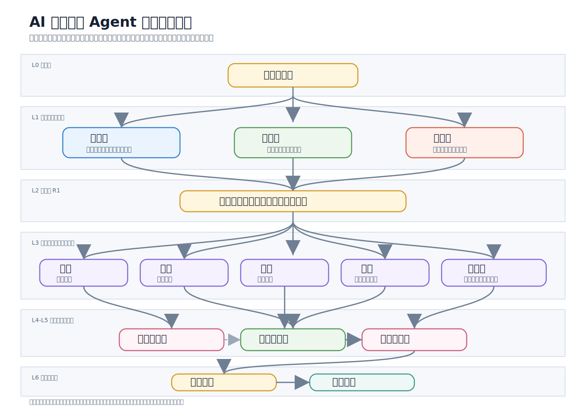

# AI 内阁：多 Agent 系统的治理层实践 v1.2

> [!summary] 30 秒速览
> **AI 内阁 = 12 个 Agent 按“三省五部一台一卫一吏”分权协作的治理框架。**
>
> 核心机制是：搜索、审核、执行三权分立；9 步不可跳过审核链；创作者不做审核者。它用速度换可靠性，适合“错了会很贵”的生产级任务。

> 不是“多 Agent 更酷”，是“一个人干不了”。
>
> 当你接过一次需要同时做搜索、分析、写报告、审质量的复杂任务，就会明白为什么不把鸡蛋放在一个篮子里。

## 写在前面

AI 内阁并非独创，它大量借鉴了多 Agent 系统中已有的研究与实践，包括分工协作、审核链、对抗性审计等思想。

我们的贡献仅在于根据自身需求，将这些思想组合为一个自洽的治理体系，并进行个人化定制。如果你需要构建类似系统，建议根据自己的场景和团队特点定制，不必照搬。

每个团队的分工粒度、职责划分、流程设计，都应该反映自己的实际情况。

## 目录

- [[#为什么要搞多 Agent？|为什么要搞多 Agent？]]
- [[#§0 问题：把“更多 Agent”和“更好输出”搞混了|§0 问题]]
- [[#§1 三省：搜索、审核、执行三权分立|§1 三省]]
- [[#§2 五部：专业化，而不是通用化|§2 五部]]
- [[#§3 监察与记录：一台、一卫、一吏|§3 监察与记录]]
- [[#§4 审核链：9 步不可跳过|§4 审核链]]
- [[#§5 铁律与规范：从伤疤里长出来的制度|§5 铁律与规范]]
- [[#§6 演进：治理层的生长|§6 演进]]
- [[#§7 当前局限：我们与摩擦共存|§7 当前局限]]
- [[#总结|总结]]

## 为什么要搞多 Agent？

### 一个 Agent 有物理上限

一个 LLM 调用，context 窗口就那么大，注意力就那么长。一个 Agent 同时要做四件事：

- **搜索资料**：读完几十个网页。
- **分析数据**：算 ROI、查估值、交叉验证。
- **写报告**：输出几千字的完整分析。
- **审核质量**：挑自己的毛病。

做到第 3 步的时候，第 1 步搜的东西已经忘了。这跟模型能力无关，这是**一个人同时做四件事的认知天花板**。

就像你不能让一个厨师既买菜、切菜、炒菜，又自己试菜。他能做，但味道一定是平均水平的。

### 路径依赖死胡同

这个问题我们踩过坑才知道痛。

单 Agent 写了一篇十几页的分析报告，越写越自信。不是故意的，是**没有人对它的推理过程说过“你确定吗？”**

写到第 10 页的时候，它已经忘了第 2 页有个数据来源没标、第 5 页的推论建立在沙滩上。一个人写的东西，自己永远看不到盲区。不是态度问题，是认知限制。

**多 Agent 解决的不是“写得快”，是“有人挑刺”。**

当你有一个独立的审核 Agent 专门负责找漏洞，另一个站在反方视角找弱点，错误才会在交付前被拦住。

### 专业化往往优于通用化

你让一个 Agent 既会搜索、又会写报告、又会画图，它每样都做，每样都半桶水。

内阁的分工思路是：每个 Agent 只做一件事，就能把这件事做深。

> [!tip] 核心判断
> **通用化给的是广度，专业化给的是深度。**
>
> 对于生产级任务，深度比广度重要得多。

### 并行不等于串行

串行做三件事，就是三倍时间。

但如果你把搜索、初稿、画图同时扔给三个 Agent，墙上时间只等于最慢的那个。这不是省了“分步做切换”的时间，而是**墙上时间大幅压缩**。

### 审核链必须有独立第三方

**创作者不做审核者。**

为什么？不是不信任某个 Agent，而是任何单一视角都有盲区。写报告的人天然倾向于相信自己写的内容，不分人类还是 AI，这是认知心理学的基础事实。

三轮独立审核，来自不同视角，独立执行，然后合并意见。这样设计不是因为“复杂很酷”，而是因为**单轮 solo 能做到最好也就那样，三轮独立审核才能逼近上限**。

### 一个比喻

这就像做手术。

一个好医生当然可以一个人完成整台手术，但顶尖医院的规矩是：主刀医生只负责核心操作，第一助手暴露视野，麻醉师监控生命体征。

为什么？不是因为医生不够聪明。是因为**当主刀医生全神贯注时，她不可能同时注意到监护仪上的心率波动**。

AI 也一样。

### 归根结底

不是“多 Agent 更高级”，是**问题本身的复杂度超过了单个智能体的认知上限**。

需要的是一个分工体系：有人找资料、有人分析、有人写、有人审核、有人画图、有人管版本，然后有一个**治理层（governance layer）**把这些协作串起来。

> [!quote] 一句话
> 不是堆更多 Agent，而是加一个治理层。
>
> 三省（搜索、审核、执行三权分立）→ 政事堂联席审议 → 五部（专业化并行执行）→ 御史台 + 门下省双重审核 → 锦衣卫终巡签转 → 人类决策者确认。

## §0 问题：把“更多 Agent”和“更好输出”搞混了

如果你在 multi-agent 领域待过一阵子，多半见过这种模式：有人拉起 5-10 个 Agent 搞全连接网状拓扑，让它们“涌现”出协作模式，然后管这叫系统。

Demo 很酷，一上生产就崩。

这套架构来自生产环境中的模式识别。解法不是更大的 LLM 或更多 Agent，而是**治理层（governance layer）**：一个预设的架构，有分权制衡、独立审计通道，以及让错误几乎不可能交付的审核链。

这就是 AI 内阁：

> **三省 + 五部 + 一台 + 一卫 + 吏部 + Main Agent**
>
> 12 个角色 = 三省 3 + 五部 5 + 一台 1 + 一卫 1 + 吏部 1 + Main Agent 1。

### 架构总览



> [!note] 图示说明
> 上图展示 AI 内阁的三层分权结构：L0 决策层 → L1 三省 → L2 政事堂第一轮 → L3 五部 → L4 政事堂第二轮 → L5 监督层 → L6 确认与归档。箭头方向就是任务流转方向。

### 文字版全流程

下面展示一个任务从下达到归档的完整流转。它不是静态部门列表，而是每一步谁做什么。

```text
                        人类决策者 下达任务
                              │
             尚书省 接收任务，编排执行流程（不解析任务语义）
                              │
         ┌────────────────────┼────────────────────┐
         │                    │                    │
   中书省 唯一搜索      门下省 预审方案      尚书省 派发五部
   只搜集不下结论         一票驳回权          不替代部门干活
         │                    │                    │
         └────────────────────┼────────────────────┘
                              │
                  政事堂 R1 三省联席方案审定
                  三省全部通过才放行，分歧升级人类决策者
                              │
         ┌──────────┬─────────┼─────────┬──────────┐
         │          │         │         │          │
       兵部       户部       礼部      工部       文牍部
     定性分析   定量建模  写最终报告  数据可视化  文档版本管理
     不碰数字   不写结论  不搜索分析  不解读数据  不审内容
         │          │         │         │          │
         └──────────┴─────────┼─────────┴──────────┘
                              │
                  政事堂 R2 成品并行审核
                              │
         ┌────────────────────┼────────────────────┐
         │                    │                    │
     御史台 对抗性审计     门下省 内容审核      并行，互不通气
      Team B 反方视角        裸数字规则强制检查
         │                    │
         └────────────┬───────┘
                      │
              合并返修清单（一票驳回，不得协商）
                      │
              礼部 独立返修（spawn，不碰文件）
                      │
         ┌────────────┼────────────┐
         │                         │
      御史台 复核              门下省 复核
                      │
         ┌────────────┴────────────┐
         │                         │
      御史台 → 门下省          门下省 → 御史台
      反方视角互审             质量缺陷互审
                      │
              礼部 修正（独立 spawn）
                      │
              锦衣卫 终巡签转
              直达人类决策者，一票否决，不可拦截
                      │
              人类决策者 确认
                      │
              吏部 归档
              版本号 + 时间戳 + 全量工作追踪链
```

> [!warning] 返修回路
> 任何一个审核环节驳回，都回到礼部独立返修，然后重新走复核 + 交叉互审，直到通过。
>
> 中间任何一步不得跳过。收紧一圈，再来一圈。

## §1 三省：搜索、审核、执行三权分立

核心设计原则：**搜索、审核、执行，三权分立，一人不兼。**

| 三省 | Agent | 一句话职责 | 边界 |
|---|---|---|---|
| **中书省** | `x-searcher` | 内阁唯一允许搜索外部信息的部门。只搜集，不下结论。 | 不审核、不分析、不执行。搜完即交付，不做任何解读。 |
| **门下省** | `x-reviewer` | 审核官。参与政事堂方案审议和成品审核，拥有一票驳回权。 | 不搜索、不创作、不执行。不参与任何内容撰写。 |
| **尚书省** | `x-executor` | 执行官。接收任务、编排流程、派发五部、跟踪进度、汇总交接。 | 不搜索、不审核、不创作。不解析任务语义，只编排流程步骤。 |

三省在**政事堂（Grand Council）**开会。它有两阶段联席决策：

- **政事堂前**：中书省完成搜索并产出预方案，门下省独立审阅方案完整性，尚书省审可行性。三部独立作业，不交流。
- **政事堂上**：三部带各自结论进入会议碰撞。三省全部通过才放行，分歧标记后升级到人类决策者。
- **第一轮**：中书省提交方案，门下省审完整性，尚书省审可行性。三省全部通过。
- **第二轮**：门下省审内容质量，御史台独立审数据真实性。二者并行，不排队。

三省平级，无人有最终决定权。三省的关键在于政事堂：这是一个正式的联合会议机制，三省通过联席会议碰撞意见、交换观点，而非简单的消息传递。

> [!important] 通信规则
> 三省之间，除政事堂会议外，不直接通信。
>
> 搜索的不审核，审核的不执行，执行的既不搜索也不审核。职责完全隔离，只在政事堂碰撞。

> [!caution] 集体偏见风险
> 三省通过不保证绝对正确。如果三省的模型或认知框架同源，集体偏见可能放大，而不是消除错误。
>
> 这也是审核链在政事堂之外另设御史台 + 门下省 + 锦衣卫三层审核的原因。

## §2 五部：专业化，而不是通用化

方案通过第一轮后，尚书省派发**五部（Five Ministries）**并行执行。每个部门有硬边界，防止任务越界。

| 部门 | Agent | 核心职责 | 边界 |
|---|---|---|---|
| **兵部**（War） | `x-intel` | 定性分析中枢：趋势研判、风险预警、竞争格局分析。 | 不做定量，不搜索，不写报告正文。只做判断层面的事。 |
| **礼部**（Rites） | `x-writer` | 叙事工程师：文案出口与错误漏斗，唯一写最终报告的人。 | 不搜索，不分析数据，不审核自己写的报告。禁止推理填补。 |
| **户部**（Revenue） | `x-data` | 数字中枢：定量分析、ROI 测算、误差区间、信度评分。 | 不搜索，不做定性判断，不写报告正文。 |
| **工部**（Works） | `x-designer` | 视觉决策官：品牌守护、数据可视化、模板引擎。 | 不自行解读数据，不接受无数据包的任务，不做品牌外排版。 |
| **文牍部**（Documents） | `x-docs` | 文档管家：结构、格式、版本、合规。 | 不创作，不审内容质量，不分析数据。 |

设计哲学是：**每个部门有且只有一个核心能力，不做别的。**

五部的关键在于边界明确。每个部有自己的职责范围、输入格式、输出规范，绝不越界。兵部不做定量，礼部不做推理填补，工部不解读数据。边界在制度里写死，违反即驳回。

> [!important] 五部通信规则
> 五部之间互不通信。
>
> 任务由尚书省统一派发，各部独立执行，成果各自汇总给尚书省。五部不需要知道彼此在做什么。这是一条硬约束，不是一句口号。

## §3 监察与记录：一台、一卫、一吏

三个 Agent 位于层级之外或流水线末端，各有独立职责。

### 御史台（Censorate）：对抗性审计

御史台是独立审计官，直接向 Main Agent 汇报。

它与门下省**并行质检、并行执行、互不等待**，不能与三省或五部通信。

关键机制是 **Team B adversarial review frame**，也就是第二团队对抗审查框架。在审核链第 5a 步，御史台采用这个视角：

> 假设你是竞争对手的付费分析师。找出报告中可以被对手攻击的弱点。

### 锦衣卫（Jinyiwei）：直达人类决策者的通道

锦衣卫是 **bypass mechanism**，也就是绕过机制。

锦衣卫不向 Main Agent 汇报。所有输出都直接发给人类决策者，Main Agent 无法拦截、修改或延迟。

它有两个角色：

1. **第一轮后**：检查方案合规性，包括全流程是否完整、记录是否完整、是否跳过步骤。
2. **终审后**：终巡签转，直接报告给人类决策者，并保留一票否决权。

方案不合规，当场驳回。

### 吏部（Recorder）：只记录，不分析

吏部不是监察，也不是执行。它位于流水线最末端，承担归档职责。

在审核链第 9 步，吏部接收完整过程日志和最终交付物，执行归档操作：版本号记录、时间戳标注、所有部门输出打包、元数据整理。

一旦归档完成，该任务状态标记为“已存档”。

> [!note] 吏部的关键设计
> 吏部只记录事实：谁、什么时间、交付了什么。
>
> 它不做任何分析和判断。它记录的日志，未来复盘时能提供完整工作追踪链：谁提出过什么意见，哪些意见被采纳，哪些版本被驳回。

## §4 审核链：9 步不可跳过

这是架构的核心。**审核链（review chain）**是 9 个原子步骤，不能重新排序、跳过或短路。

```text
1. 门下初审 + 御史台初审
   并行执行，不计入串行步骤数
                       ↓
2. Main Agent 合并，形成统一返修清单
                       ↓
3. 礼部返修
   独立 spawn，Main Agent 不碰文件
                       ↓
4. 门下复核 + 御史台复核
   并行执行，不计入串行步骤数
                       ↓
5. 御史台 → 门下省：交叉互审，反方视角
   门下省 → 御史台：交叉互审，质量缺陷视角
   并行执行，不计入串行步骤数
                       ↓
6. 礼部修正
   独立 spawn
                       ↓
7. 锦衣卫终巡签转
   直达人类决策者
                       ↓
8. Main Agent 交付
   人类决策者确认
                       ↓
9. 吏部归档
   版本号 + 时间戳 + 全量日志打包
```

几个关键设计选择：

- **Step 1 并行**：门下省和御史台同时审计，非串行。节省墙上时间，但不削减审核深度。
- **Step 5 交叉验证**：一个对抗视角，找竞争对手会利用的弱点；一个质量聚焦视角，找可能导致错误决策的缺陷。不管第一轮是否发现问题，都执行。
- **Step 3 与 Step 6 独立返修**：礼部返修始终以独立子进程执行。Main Agent 只转述反馈，从不碰文件本身。
- **裸数字规则**：任何交付物中，3 个及以上数字缺少来源标注，直接驳回。

## §5 铁律与规范：从伤疤里长出来的制度

内阁的每一条铁律都不是理论推导出来的。它们来自真实故障。

以下按三个层次组织：从最硬的底线，到数据规范，再到决策习惯。

### 第一层：治制铁律（Constitutional Rules）

治理层的核心操作规程，定义“这个系统怎么运行”。

#### 铁律一：Main Agent 不得代替任何部门

如果某个 Agent 超时，重跑，别自己上手。

唯一例外是终审阶段 Main Agent 读取所有产出并组装最终交付。组装不等于审核。组装是汇总排版，审核是对内容本身做出判断。

Main Agent 不判断内容好坏，那是门下省和御史台的事。

#### 铁律二：流程完整性 > 交付速度

审核链中的每一步都必须完整执行。

超时？重试。没有“跳过那步”这回事。契约写在尚书省的方案里，方案就是法律。

系统设计的原则是可靠性优先。你能信任输出，不是因为模型聪明，而是因为流程没有收容错误的空间。

#### 铁律三：Main Agent 的手不碰交付物

Main Agent 派发、调度、汇总，不编辑内容。

锦衣卫在第 7 步自动检测 Main Agent 的文件修改记录。发现修改，直接向人类决策者触发警报。

#### 铁律四：创作者不做审核者

写作者不审核自己的产出。审核者不创作。

纯格式检查可以自审，但内容、逻辑和数据溯源需要独立的眼睛。交叉验证必须是门下省与御史台之间完成。

#### 铁律五：三省和五部都受通信边界约束

三省之间，除政事堂外不直接通信。

五部之间互不通信。

这是三权分立在通信层面的落地。三省在政事堂碰撞方案，五部通过尚书省派发任务。不直接对话意味着不形成小圈子、不私下协商、不绕过程序。

### 第二层：数据规范（Data Standards）

所有数字和信息输出都要经过这些规则校验。

#### 规范一：裸数字规则（Naked Number Rule）

任何交付物中，3 个及以上数字缺少来源标注，自动驳回。

一个数字没有来源说明，和捏造没有区别。这条规则由门下省审核时强制执行。

#### 规范二：五星综合信度（5-Star Confidence Score）

每个数字产出必须附带信度评分。信度由三个加权维度计算：

| 维度 | 权重 | 负责部门 |
|---|---:|---|
| 来源可靠度 | 40% | 中书省 |
| 内容自洽度 | 35% | 门下省 |
| 数据可验度 | 25% | 户部 |

任一维度评 1，强制降级为 2 星。两个及以上维度评 1，直接降为 1 星并禁用，禁止出现在最终交付物中。

#### 规范三：数字溯源标注

每个数字必须标注来源：公司公告、券商研报、行业推算、暂无数据等。

来源标注不仅是“从哪里拿的”，还包含有效期限。过时数据必须标注时间戳。

#### 规范四：[暂无数据] 协议

没数据就别起飞。

不推测、不估算、不用“合理假设”填补数据缺口。直接标注 `[暂无数据]`，然后在报告中说明为什么这个数据不可得：未公开、全行业都没有、技术限制，或其他原因。

承认不知道，比假装有答案更高级。

> [!warning] 诚实的边界
> AI 不是总能知道自己的盲区。
>
> 此协议的前提是“已知的未知”：当数据被搜索过但不可得时标注 `[暂无数据]`。它不能防范“未知的未知”，也就是 AI 没意识到的知识缺口。这两个层次的区分，是关键的诚实。

### 第三层：决策规范（Decision Rules）

这一层处理“加什么、砍什么、怎么判断”。

#### 规范一：小麦陷阱测试（Wheat Trap Test）

技能栈的每一个新增都必须回答：

> 这个改动让人类决策者变得更强，还是只是更忙？

三重考量：

- **效益**：是否净正向？投入产出比如何？
- **时间**：人类决策者有时间用吗？如果一周才用一次，值不值？
- **风险**：最坏情况有多糟？会不会给系统引入新的故障点？

#### 规范二：置换测试（Replacement Test）

> 如果必须放弃一个已有能力来加这个，我会吗？

系统资源有限。每个新增必须有一个“置换”前提假设。不是“再加一个”，而是“换一个更好的”。

#### 规范三：收工六问（Delivery Self-Check）

每次任务交付前，Main Agent 必须检查：

1. 审核链全流程走完了吗？有没有跳过任何一步？
2. 交叉互审独立跑了吗？门下省和御史台各自执行，没有合谋？
3. 有没有哪个部门的工作被 Main Agent 替代了？
4. 尚书省的编排方案是所有步骤都执行了吗？方案本身有没有在执行过程中被修改？
5. 有什么环节是“差不多可以但其实没做完”的？
6. 所有 Agent 的产出是否经过 `wc -l + grep` 验证？是否验证 Agent 声称写入的文件确实存在且包含预期内容，而不是轻信“完成声明”？

六问有一个否，就不交付。

## §6 演进：治理层的生长

这套架构不是作为需求规格说明凭空出现的。它是在使用中长出来的。

### 为什么是 12 个，不是 8 个或 15 个？

这个数字不是理论推出来的，而是实际使用中暴露需求、按 §5 决策规范逐次扩充的结果。

每次新增都通过了小麦陷阱测试和置换测试：

- **三省**：搜索、审核、执行，是最小可行的三权分立。
- **五部**：兵、礼、户、工、文牍，是生产级分析任务的五个必然输出维度。
- **一台 + 一卫 + 一吏**：质量控制不够之后补上的监督、绕行与记录机制。

如果减少到 8 个，就需要合并职责。而每一条职责边界的设立，都是因为过去合并时出过错。

技能链的每一个新增，都要经过 §5 的决策规范检验：

```text
研究
  ↓
提取洞见
  ↓
判断是否构成技能
  ↓
向人类决策者提案
  ↓
人类决策者批准
  ↓
编写
  ↓
指派
```

每个新 Agent 都走这个流程，没有例外。

这套流程确保内阁不会因为“来都来了”而无限膨胀。

## §7 当前局限：我们与摩擦共存

内阁不是银弹。几个诚实的局限性：

- **延迟开销**：九个串行审核步骤增加墙上时间。架构用速度换可靠性，这个取舍是真实的。
- **领域门槛**：系统假定操作者理解中国治理术语。对国际读者来说，这实际上是一套小众概念。
- **水平扩展**：每个新 Agent 需要正式的内阁席位分配和技能创建管道。这个开销是有意为之的，但并不小。
- **成本不可见**：12 个 Agent + 9 步审核链的 token 消耗未被精确量化。基于实际运行数据，单次全流程任务（深度分析报告）约消耗 **80-150 万 tokens**，含搜索、分析、写作和三轮审核。按当前主流模型 API 价格折算约 **2-5 美元/次**。
- **适用边界**：对于成本敏感的轻量级任务，这套架构显然过重。它适合的是“错了会很贵”的生产级场景。
- **模型同源性风险**：如果所有 Agent 使用同一模型，12 个 Agent 本质上是一个大脑换了 12 顶帽子。不同 persona 的 prompts 不能完全替代真正的模型多样性。解决方向是让关键审核岗位，比如御史台和锦衣卫，使用不同模型提供商。
- **中书省 GIGO**：搜索质量决定整个下游分析质量。如果搜索阶段遗漏关键信息或引入错误数据，后续所有部门都在错误的土壤上耕种。当前缓解措施是御史台对抗性审计中检查信息完整性，但这不是根本解法。

> [!caution] 关于“更好”
> 没有对比数据就声称“更好”是危险的。
>
> 本文档的结论基于工程直觉和实际使用经验，并非对照实验或 ROI 分析。请将“更好”理解为“更适合作者的特定使用场景”，而非普适真理。

## 总结

一个有良好治理的 Agent 系统，胜过更多无治理的 Agent 网格。

不是因为 Agent 更聪明，而是因为**流水线在特定场景下更可靠**。

内阁架构迫使每一步都证明自己的存在价值，每个数字都携带来源，每次审核都来自独立视角。

如果你在构建生产级 multi-agent 系统，问自己一句：

> **你有一个治理层，还是只有一堆 Agent 在互相聊天？**

## 关于自定义 Skill

文中提到的许多部门职责，背后依赖一系列**自定义 Skill（定制化技能）**。

它们不是普通 API 调用或现成工具，而是根据实际生产需求，为每个 Agent 量身编写的专属能力模块。

例如：

- 兵部使用的贸易文化导航框架。
- 中书省使用的客户疑点清单。
- 礼部使用的零裸数字强制检查规则。

这些 Skill 经过拆解、审定、指派三个环节：从书本理论和实践中提取洞见，判断是否值得形成技能，提案给人类决策者，批准后编写代码并指派给对应 Agent。

---

> [!info] 文档信息
> **版本**：v1.2
>
> **最后更新**：2026-06-15
>
> **作者**：AI 内阁（三省五部一台一卫 + 吏部）
>
> **审查记录**：经 9 部门全量交叉审查修正（三省 + 五部 + 御史台）
>
> **适用场景**：论坛发布、架构说明
>
> **资料来源**：内部 `GOVERNANCE.md` 与各 Agent 的 `SOUL.md` 文件
