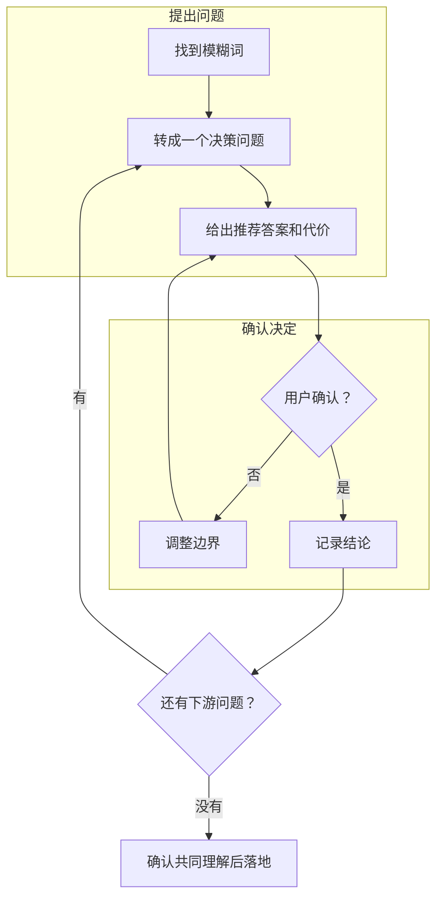
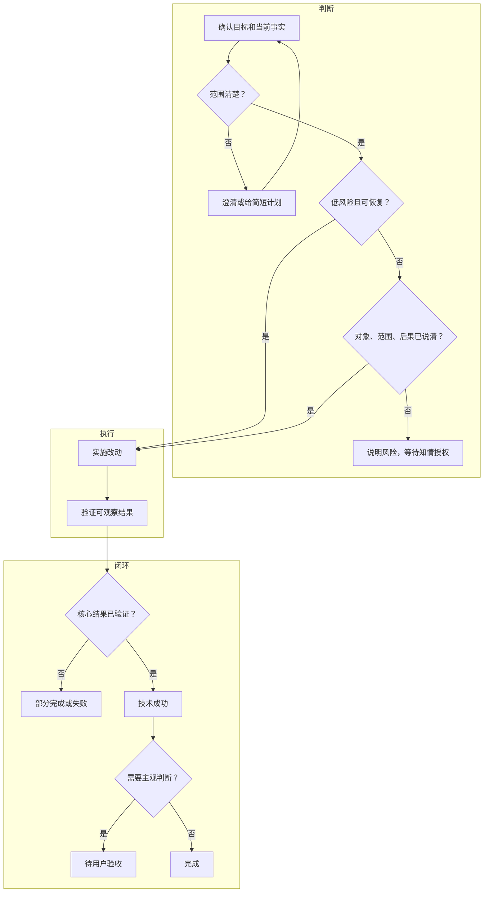
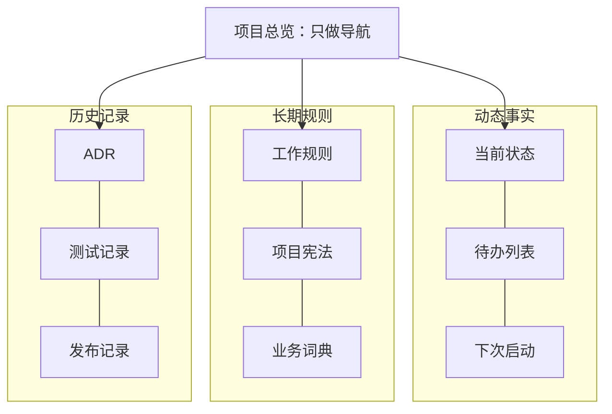

# Grill-me 实践：用连续追问建立可执行的 AI 工作区规则

> Grill-me 用单题追问把“谨慎处理”“重要时确认”等模糊要求拆成明确决策，再整理成有限自主、知情授权、证据验收和长期记忆规则。结果不是一段更长的提示词，而是一套能判断何时直接执行、何时停手的工作机制。文末附有可直接复制的工作规则模板。

| 规则要回答什么 | 核心答案 |
|---|---|
| 什么时候直接做？ | 低风险、边界清楚、可恢复 |
| 什么时候先问？ | 高风险、不可逆、范围或后果不清 |
| 什么叫完成？ | 技术证据通过，主观结果由用户验收 |
| 怎样跨会话接续？ | 每类事实只放在一个权威文件 |

## 1. Grill-me：一次只解决一个决定

Grill-me 沿决策树往下走，每轮只处理一个选择。



执行时遵守五条：事实由 AI 自己查；只问需要用户决定的事；一次只问一个问题；每题给出推荐答案；共同理解确认前不动文件。

## 2. 任务主流程：有限自主推进



| 情况 | 默认动作 |
|---|---|
| 普通编辑、只读检查、可恢复修改 | 直接执行 |
| 路线不明、影响较大、有多种取舍 | 先给计划 |
| 真实数据、重要删除、不可逆迁移、发布、权限扩大 | 知情授权后执行 |
| 风险变化或范围扩大 | 原授权失效，重新确认 |

知情授权至少说清：**对象、范围、后果、不包含什么**。删除前还要核对路径和恢复方式。

## 3. 两条真相链，两种边界

| 问题 | 权威顺序 |
|---|---|
| **要去哪里** | 用户最新知情指令 → 本轮任务 → 项目宪法与工作规则 → 历史偏好 |
| **现在在哪里** | 当前代码、文件、数据和运行结果 → 已核验状态文档 → 任务假设 → 旧会话 |

用户指令决定目标，现实证据决定起点。最新指令不能悄悄覆盖数据安全、权限等保护规则。

| 可以自主调整 | 必须重新确认 |
|---|---|
| 完成目标必需的相邻代码、测试和类型 | 新增原任务没有要求的功能 |
| 修正已被现实证伪的技术假设 | 改变用户可见行为或业务规则 |
| 更换不改变结果和风险的实现路径 | 扩大数据、权限、发布或系统影响 |
| 记录范围外普通问题 | 触碰明确禁止修改的文件 |

遇到高风险异常时，冻结写入、删除、迁移和发布，但继续安全的只读诊断。

## 4. 完成分成技术状态和验收状态

| 状态 | 判断依据 | 可选值 |
|---|---|---|
| 技术状态 | 测试、运行结果、静态检查或标准案例 | 成功 / 部分完成 / 失败 |
| 验收状态 | 界面、业务感觉、内容质量等主观判断 | 待验收 / 已通过 / 需调整 |

验证不必固定为 `build + lint + test`。报告需要分清已确认事实、推断、建议、未验证项，以及证据覆盖不到的地方。

## 5. 长期项目：每类事实只有一个家



动态文件可以更新；ADR、测试和发布记录追加保存，不重写历史。每份文档至少写明状态、最后更新、最后核验和权威范围。

## 6. Git、发布和密钥

| 场景 | 默认规则 |
|---|---|
| `git status`、`git diff`、查看历史 | 可直接执行 |
| `git add`、`commit`、建分支、切分支 | 任务明确要求时执行 |
| push、PR、远程 tag、Release | 取得外部动作授权 |
| 发布包 | 允许清单 + Manifest + 敏感扫描 + 解压抽查 |
| 版本包 / `latest` | 历史版本不覆盖；验证后更新 `latest` |
| 已配置凭据 | 可以调用，但不读取、回显或复制明文 |

备份看能不能恢复，不看有没有复制文件。恢复过程没有验证，就不能把“有备份”写成“可恢复”。

## 7. 直接使用

<details>
<summary><strong>工作规则模板：WORK_RULES.md</strong></summary>

```markdown
# 项目工作规则

## 1. 目标与范围
- 项目目标：
- 允许修改：
- 只读参考：
- 禁止触碰：

## 2. 默认执行方式
- 低风险、边界清楚、可恢复：直接执行。
- 路线不明或影响较大：先给简短计划。
- 真实数据、重要删除、不可逆迁移、发布、权限扩大：知情授权后执行。
- 风险变化或范围扩大：停止变更，重新确认。

## 3. 授权边界
- 授权说清对象、范围、后果和排除项。
- 初始指令已经充分知情时，不机械二次确认。
- 最新指令不能静默覆盖数据安全、权限和不可触碰项。

## 4. Scope 调整
- 可自主修改完成目标必需的相邻代码、测试和类型。
- 不得擅自新增功能、改变业务规则或扩大数据、权限、发布范围。
- 范围外普通问题只记录；安全问题冻结危险动作并报告。

## 5. 验证与完成
- 验证可观察结果，不机械套用固定命令。
- 技术状态：成功 / 部分完成 / 失败。
- 验收状态：待验收 / 已通过 / 需调整。
- 报告列出已确认事实、未验证项、证据边界和剩余风险。

## 6. Git、同步与发布
- status、diff、查看历史可直接执行。
- add、commit、分支操作仅在任务明确要求时执行。
- push、PR、tag、Release、部署和外部同步必须授权。
- 不把用户已有修改混入提交。

## 7. 停手条件
- 高风险动作缺少知情授权。
- 现实与任务冲突，并会改变结果、范围或不可逆性。
- 出现相关并发修改、敏感信息风险或无法判断影响边界。
- 停手后继续安全的只读诊断。

## 8. 长期记忆
- 当前状态、待办、规则、业务定义各有唯一权威文件。
- ADR、测试和发布记录追加保存，不改写历史。
- 文档写明状态、最后更新、最后核验和权威范围。

## 9. 项目特殊规则
- 快速通道：
- 最小测试：
- 备份与恢复：
- 已批准例外及失效条件：
```

</details>

<details>
<summary><strong>Grill-me 提示词</strong></summary>

```text
请用 Grill-me 方式审问这套方案：

1. 一次只问一个决策问题；
2. 每题给出推荐答案和主要代价；
3. 能从文件、代码或环境查到的事实直接核实，不反问用户；
4. 前一个决定确认后，再进入下一条分支；
5. 重点追问“默认、必要、重要、风险、完成、同步”等模糊词；
6. 共同理解确认前，不修改文件、不执行方案；
7. 最后整理成无冲突、可验证、可执行的规则。
```

</details>

工作区规则最后只需回答三件事：什么可以直接推进，什么必须由用户决定，用什么证据证明完成。

**可恢复范围内主动推进，不可逆边界前保持清醒。**
