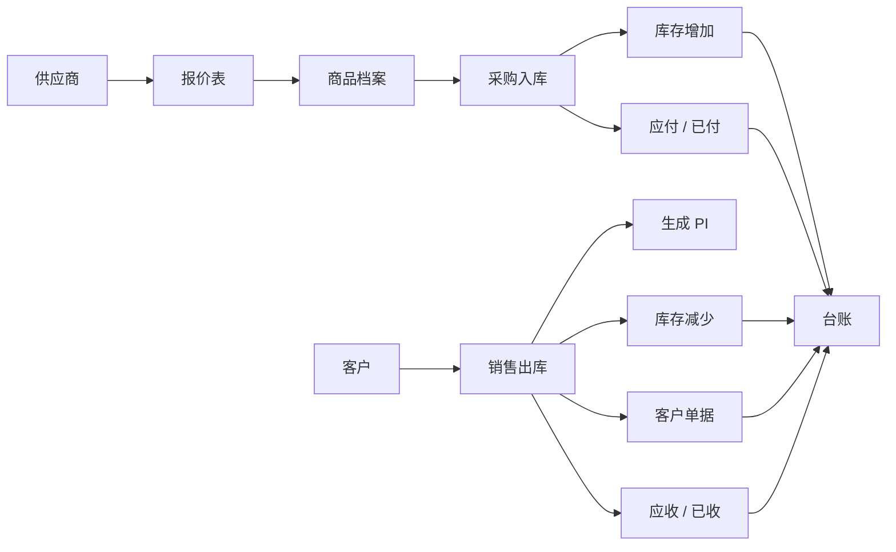
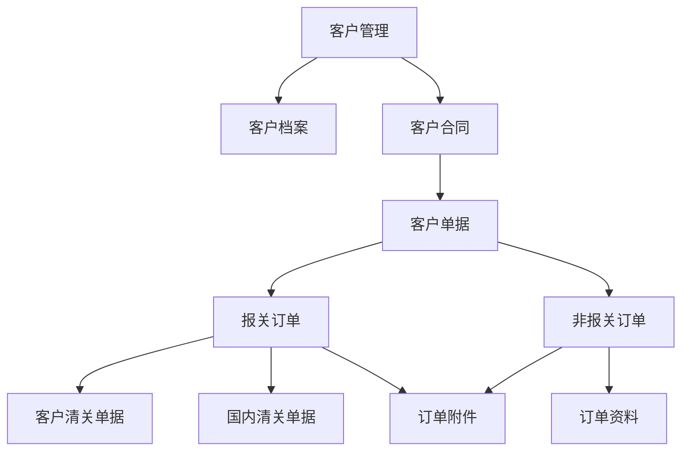
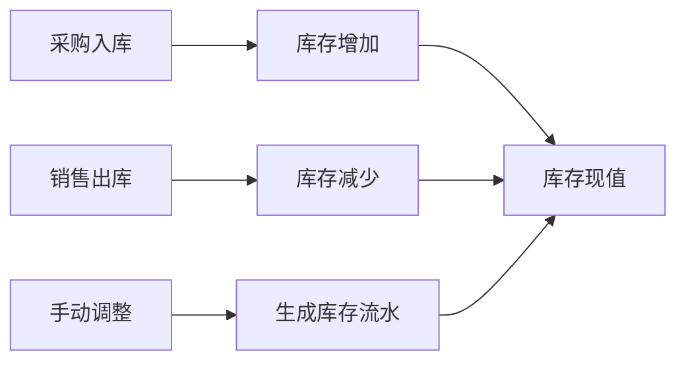

# 从零搭建定制ERP：一个外贸进销存系统的实战记录

> 一篇关于“小型外贸业务如何从真实需求出发，逐步搭建一套定制 ERP”的项目复盘。它不是标准产品介绍，更像一次业务系统从 0 到 1 的实操记录。


## 简短摘要

这篇文章记录了一套小微外贸进销存 ERP 从 0 到 1 的搭建过程：从最初的供应商、商品、采购、销售和库存管理，逐步扩展到客户单据、收付款、台账、审计、AI 识别和标准案例测试。核心经验是：ERP 的价值不在于堆功能，而在于把业务录入、数据关联、自动汇总、异常检查和持续优化形成闭环。

## 文章速览

| 维度 | 内容 |
| --- | --- |
| 项目类型 | 小微外贸进销存 ERP |
| 核心目标 | 管供应商、商品、采购、销售、库存、客户单据、收付款和利润台账 |
| 部署方式 | 本地运行，支持内网多电脑访问 |
| 数据重点 | 让订单、产品、供应商、客户、单据、收付款互相追溯 |
| 迭代方法 | 真实业务驱动，小步优化，持续闭环 |
| 经验关键词 | 少填、少错、能追溯、能汇总、能导出、能复盘 |

## 目录

- [背景](#背景)
- [一、最初的目标](#一最初的目标)
- [二、从本地桌面系统开始](#二从本地桌面系统开始)
- [三、模块从少到多，但核心始终是业务关系](#三模块从少到多但核心始终是业务关系)
- [四、供应商和报价表](#四供应商和报价表)
- [五、客户管理和客户单据](#五客户管理和客户单据)
- [六、采购、销售和库存闭环](#六采购销售和库存闭环)
- [七、收付款和台账](#七收付款和台账)
- [八、权限、审计和数据安全](#八权限审计和数据安全)
- [九、AI 识别的加入](#九ai-识别的加入)
- [十、邮件功能](#十邮件功能)
- [十一、标准案例测试数据](#十一标准案例测试数据)
- [十二、Looping Engineering 的构想](#十二looping-engineering-的构想)
- [十三、部署、代码和知识库管理](#十三部署代码和知识库管理)
- [十四、最大的收获](#十四最大的收获)
- [十五、后续优化方向](#十五后续优化方向)
- [结语](#结语)

## 总体业务链路



---

## 背景

最开始的需求很朴素：我需要一套能登记供应商、管理采购和销售、统计收付款、管理库存、保存客户单据的系统。

市面上的 ERP 很多，但真正用起来，经常会遇到两个问题：

- 功能很全，但流程太重，很多字段并不适合自己的业务。
- 看起来能用，但客户单据、供应商报价、采购、销售、库存和收付款之间很难形成顺畅闭环。

所以我决定先做一套本地运行的轻量 ERP。目标不是一开始就做成“大而全”的系统，而是先贴合真实业务，把每天会用到的流程跑通，再在使用中逐步优化。

---

## 一、最初的目标

第一版目标很明确：先把核心业务录进去、查得到、算得出。

### 基础能力清单

| 模块 | 初始目标 |
| --- | --- |
| 供应商 | 保存供应商档案、联系人、电话、地址 |
| 商品库存 | 记录型号、颜色、HS Code、库存和供应商 |
| 采购销售 | 完成采购入库和销售出库 |
| 收付款 | 区分应收、已收、应付、已付 |
| 客户资料 | 保存客户档案、合同和单据 |
| 文件上传 | 支持多文件、多图片归档 |
| 图片识别 | 尝试从采购单、销售单、报价表图片中识别内容 |
| 多电脑访问 | 本地运行，通过内网访问给多台电脑使用 |
| 持续维护 | 保留后续升级、测试和文档空间 |

这个阶段最重要的不是界面漂亮，而是业务闭环完整。

---

## 二、从本地桌面系统开始

最早的版本是一个本地桌面 ERP：在 Windows 电脑上启动服务，通过浏览器打开本地访问地址。

后来考虑到办公室电脑、家里电脑可能都要用同一套数据，于是加入了内网访问方案。这样不需要把系统暴露到公网，也能让不同电脑访问同一台主机上的 ERP。

### 这种部署方式的优点

- 成本低，不需要购买复杂服务器。
- 数据在自己电脑上，掌控感更强。
- 多电脑访问可以通过内网工具实现。
- 后期如果业务量上来，也可以迁移到数据库和专门服务器。

---

## 三、模块从少到多，但核心始终是业务关系

系统最初只有几个基础模块，后来逐步扩展成完整结构。

### 当前模块结构

| 类型 | 模块 |
| --- | --- |
| 经营视图 | 经营总览、台账、系统自检 |
| 基础资料 | 供应商管理、商品与库存、客户管理 |
| 业务单据 | 采购与销售、客户单据、出入库流水 |
| 财务相关 | 收付款管理、进项发票统计 |
| 辅助能力 | 邮件、审计日志、文件上传、图片识别 |

做了一段时间后，我越来越明确一件事：ERP 的关键不是页面数量，而是数据关系是否顺畅。

比如一张销售单，不能只记录“卖了什么”，还应该能继续追溯：

```text
销售单 → 客户 → PI → 产品 → 供应商 → 成本 → 收款 → 库存 → 台账利润
```

这些关系一旦打通，系统才会真正变成业务工具，而不只是电子表格的替代品。

---

## 四、供应商和报价表

供应商模块一开始只是登记基础信息，例如名称、联系人、电话和地址。

后面发现，采购真正需要的是“供应商和报价的长期沉淀”。于是系统加入了供应商报价表：每个供应商下面可以保存多份报价表，报价表可以上传原件图片，也可以把识别出的产品、型号、单价整理成表格。

### 供应商模块的演进

| 阶段 | 变化 |
| --- | --- |
| 初版 | 只记录供应商基础档案 |
| 第二步 | 增加供应商报价表 |
| 第三步 | 报价表支持原件上传和图片识别 |
| 第四步 | 报价表可修改名称、支持多文件 |
| 第五步 | 供应商界面显示应付、已付、未付金额 |

供应商模块就不只是通讯录，而是采购价格和应付款的入口。

---

## 五、客户管理和客户单据

客户管理是后期改动最多的部分。

一开始，客户档案、客户合同、单据库是分散的。实际使用后发现，分散会让资料越来越乱，尤其是外贸订单涉及 PI、PL、CI、报关单、采购发票、提单、收汇水单等大量文件。

后来我把它们合并成一条关系：

```text
客户档案 → 客户合同 → 客户单据 → 订单 / CI No.
```

### 客户单据分组



### 报关订单常见资料

| 分组 | 常见资料 |
| --- | --- |
| 客户清关单据 | PI、PL、CI |
| 国内清关单据 | CI、PL、contract、国内采购合同、国内采购发票、国内运费发票、国际运费发票、报关单、报关委托书、放行书、出口退税联、报关费发票、提单、收汇水单、结汇水单、出口发票 |
| 订单附件 | 打包照片、发货照片、售后照片、其他附件 |

“订单附件”这个小功能很实用。很多售后问题最后都要回头查包装、装箱、发货现场照片，如果这些图片一开始就挂在订单下面，后续追溯会轻松很多。

---

## 六、采购、销售和库存闭环

采购和销售是 ERP 的主干。

### 采购入库字段

| 类型 | 字段 |
| --- | --- |
| 单据信息 | 供应商、PI No.、日期 |
| 产品信息 | 产品名称、型号、颜色、数量、单价、总金额、HS Code |
| 税务信息 | 税点、不含税金额、含税金额 |
| 附件 | 采购单、发票、图片或其他文件 |

### 销售出库字段

| 类型 | 字段 |
| --- | --- |
| 客户信息 | 客户名称、客户资料、币种 |
| 产品信息 | 产品名称、型号、颜色、数量、单价、总金额、HS Code |
| 来源追溯 | 每个产品对应供应商 |
| PI | 自动生成、预览、修改、下载 |

### 库存同步逻辑



后续为了减少重复录入，又做了业务录入闭环优化：

- 采购选择供应商后，商品下拉只显示该供应商的商品。
- 选择商品后，自动带出型号、颜色、HS Code、供应商、价格。
- 销售单每个产品行都保存供应商来源。
- 库存流水记录客户、供应商和业务日期。

这些细节看起来不大，但对后续查账、算利润、查供应商来源非常关键。

---

## 七、收付款和台账

收付款模块最初只是记录收入和支出，后来逐步细化成更接近财务视角的结构。

### 收付款支持内容

| 分类 | 内容 |
| --- | --- |
| 状态 | 应收、已收、应付、已付 |
| 币种 | 人民币、美元 |
| 关联对象 | 客户、供应商、订单 |
| 查询方式 | 按客户、供应商、销售单分组，按年/月汇总 |
| 附件 | 水单、发票、付款凭证等多文件上传 |

### 台账字段

| 类别 | 字段 |
| --- | --- |
| 订单信息 | PI 号、客户名称、联系方式、订单来源 |
| 产品信息 | 采购产品、供应商、成本、售价 |
| 财务信息 | 美元售价、人民币售价、汇率、平台费用、物流费用、毛利润 |

台账模块的定位很清楚：老板看利润，业务看订单，财务看收付款。

---

## 八、权限、审计和数据安全

随着系统越来越接近真实业务使用，权限和安全也必须补上。

### 角色层级

| 角色 | 权限 |
| --- | --- |
| admin | 看全部数据、管理用户、改配置、看审计日志 |
| manager | 看全部业务数据、看台账，不能管理用户 |
| 普通账号 | 处理日常业务，不显示台账和审计日志 |

### 数据保护

- 写入前自动备份。
- 写入冲突检测，避免多人同时保存时互相覆盖。
- 保存成功和保存冲突都会写审计日志。
- 重要资料支持导出和备份。

目前系统仍然是轻量本地数据库方案。对于小规模使用来说已经够用，但如果未来多人高频使用，下一步最好迁移到 SQLite 或 PostgreSQL。

---

## 九、AI 识别的加入

这个系统也尝试加入视觉识别能力，用来处理图片和文件录入。

主要场景包括：

- 上传采购单图片，自动识别采购内容。
- 上传销售单图片，自动识别销售内容。
- 上传报价表图片，自动识别产品、型号、单价。

这里的思路不是让 AI 完全替代人工，而是“先自动填，再人工核对”。

```text
图片 / 文件 → AI 初步识别 → 表单自动填入 → 人工核对 → 保存入库
```

这样既能节省录入时间，又不会因为识别错误直接污染业务数据。

---

## 十、邮件功能

后面系统还加入了邮件模块。

主要支持：

- SMTP 配置
- 多收件人
- 附件发送
- 按收件邮箱归档
- 查看历史邮件内容

这个功能主要用于把 PI、报价、单据直接从系统发给客户，并保留发送记录。

---

## 十一、标准案例测试数据

做了一段时间后，我发现每次改功能，如果只靠真实业务数据测试，很容易漏问题，也不安全。

所以后来专门做了一套标准案例测试数据，用于回归测试。

### 标准案例覆盖范围

| 业务环节 | 测试内容 |
| --- | --- |
| 基础资料 | 供应商、商品、客户 |
| 采购销售 | 采购入库、销售出库 |
| 单据归档 | 报关单据、非报关单据、订单附件 |
| 财务 | 应收、已收、应付、已付 |
| 库存 | 出入库流水、库存同步 |
| 台账 | 成本、售价、费用、利润 |
| 辅助功能 | 邮件历史、文件上传 |

这套标准案例可以一键导入，导入前会自动备份当前数据库。

它的价值很大：后续每次改功能，都可以先跑一遍完整业务闭环，而不是拿真实业务数据冒险。

---

## 十二、Looping Engineering 的构想

做到后期，我开始把这个项目理解成一种“Looping Engineering”：不是一次性把系统设计完，而是围绕真实业务持续建立反馈循环。

这里的 loop 不是简单的反复修改，而是每次都让系统多形成一个闭环：


### 五类核心循环

| Loop | 目标 | 例子 |
| --- | --- | --- |
| 业务录入闭环 | 少填、少错 | 选择供应商后过滤商品，选择商品后自动带出型号和价格 |
| 数据一致性闭环 | 发现断链 | 检查商品供应商、库存流水、订单收付款是否对应 |
| 标准案例测试闭环 | 稳定回归 | 用固定测试数据验证采购、销售、库存、收付款和台账 |
| 文档和部署闭环 | 下次接得上 | 维护说明、部署记录、更新日志和版本规则 |
| 人机协作闭环 | 快速迭代 | 先做可用版本，再根据真实使用反馈小步优化 |

Looping Engineering 的核心不是“反复做”，而是让每次迭代都沉淀成一个更可靠的业务闭环。

---

## 十三、部署、代码和知识库管理

项目资料后来分成两类管理：

| 类型 | 用途 |
| --- | --- |
| 代码仓库 | 保存部署包、代码和脱敏测试数据 |
| 本地知识库 | 保存项目说明、部署记录、更新日志和使用说明 |

同时约定了几条安全规则：

- 不上传真实业务数据库。
- 不上传登录账号文件。
- 不上传邮箱授权码。
- 不上传真实业务单据。
- 安装包更新必须带版本号。
- 重要更新写入知识库，但小改动不一定同步。

这个过程让我意识到：项目能持续迭代，文档和备份非常重要。

---

## 十四、最大的收获

这个项目最大的体会是：ERP 不是表单堆起来的，而是关系跑通的。

一个好用的小企业 ERP，核心应该是：

```text
少填
少错
能追溯
能汇总
能导出
出问题能查
```

具体来说：

- 销售单里的每个产品，都应该知道来自哪个供应商。
- 客户单据必须能按订单和 CI No. 找到。
- 收付款必须能对应客户、供应商或订单。
- 库存变化必须留下流水。
- 利润必须能从台账里算出来。

这些关系一旦打通，系统就开始真正有用了。

---

## 十五、后续优化方向

后面还可以继续优化：

| 方向 | 说明 |
| --- | --- |
| 数据库升级 | 从轻量数据存储迁移到 SQLite 或 PostgreSQL |
| 并发能力 | 增强多人同时使用的安全性 |
| OCR | 提高单据和报价表识别准确率 |
| 移动端 | 优化手机端页面适配 |
| 邮件模板 | 管理常用报价、PI、发货通知模板 |
| 报关资料 | 自动生成资料清单，检查缺件 |
| 利润分析 | 自动生成利润和费用分析报表 |
| 权限系统 | 设计更细的角色权限 |
| 备份恢复 | 把数据备份和恢复做成界面化操作 |

---

## 结语

这套定制 ERP 不是一开始就设计完整的，而是在真实业务里一点点长出来的。

从供应商登记、报价表、采购销售、库存、客户单据，到收付款、台账、审计、多电脑共享，每一步都是围绕实际问题改出来的。

现在它已经不只是一个“录数据的工具”，而是一个能帮助整理业务关系、减少重复输入、沉淀订单资料的小型业务系统。

对小公司来说，最适合自己的 ERP，往往不是最贵、最复杂的那个，而是最贴近自己业务流程、能持续优化的那个。
