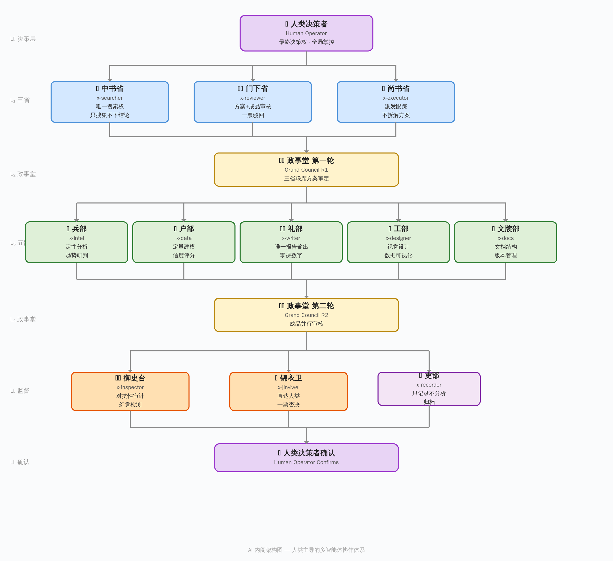
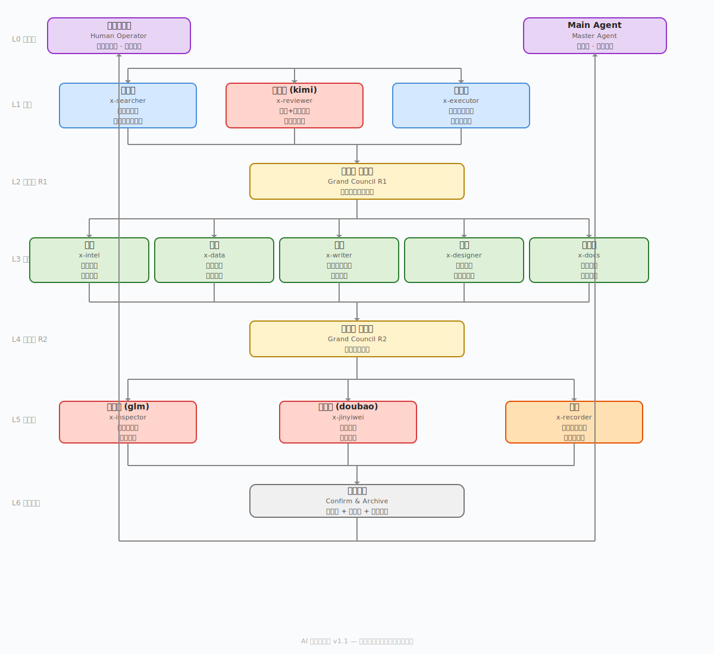

# AI 内阁：多 Agent 系统的治理层实践 v1.2

> **说明**：AI 内阁并非独创。它借鉴了多 Agent 系统中已有的分工协作、审核链、对抗性审计等思想。本文的贡献在于：根据个人生产场景，把这些机制组合成一套自洽的治理体系，并进行个人化定制。若你要构建类似系统，建议根据自己的任务类型、团队分工和风险阈值重新设计，不必照搬。

> 不是“多 Agent 更酷”，而是“一个人干不了”。当你接过一次需要同时搜索、分析、写报告、审质量的复杂任务，就会明白为什么不能把所有鸡蛋放在一个篮子里。


## 简短摘要

这篇文章介绍了一套面向个人复杂任务的多 Agent 治理框架：用 12 个分工明确的 Agent 模拟内阁式协作，把搜索、分析、写作、审校、风险控制和最终决策拆开处理。它的重点不是炫技式堆 Agent，而是通过分权、复核、审计和终局裁决，让一个人在处理高复杂度任务时获得更稳定的质量控制和更低的认知负担。

## 30 秒速览

AI 内阁是一套由 **12 个 Agent** 组成的多 Agent 治理框架，参考“三省五部一台一卫一吏”的分权结构。

核心机制：

- **三权分立**：搜索、审核、执行相互隔离。
- **9 步审核链**：关键流程不可跳过。
- **创作者不做审核者**：所有成品必须经过独立审查。
- **用速度换可靠性**：适合“错了会很贵”的生产级任务。

<p align="center">
  
</p>

<p align="center"><em>图 1：AI 内阁治理层总览。任务从人类决策者进入，经三省审议、五部执行、监察复核、锦衣卫终巡，最终归档。</em></p>

## 目录

- [为什么要搞多 Agent？](#为什么要搞多-agent)
- [§0：问题 - 把“更多 Agent”和“更好输出”搞混了](#0问题---把更多-agent和更好输出搞混了)
- [§1：三省 - 搜索 ≠ 审核 ≠ 执行](#1三省---搜索--审核--执行)
- [§2：五部 - 专业化，非通用化](#2五部---专业化非通用化)
- [§3：监察与记录 - 一台 + 一卫 + 一吏](#3监察与记录---一台--一卫--一吏)
- [§4：审核链 - 9 步不可跳过](#4审核链---9-步不可跳过)
- [§5：铁律与规范](#5铁律与规范)
- [§6：演进 - 治理层的生长](#6演进---治理层的生长)
- [§7：当前局限](#7当前局限)
- [总结](#总结)

## 为什么要搞多 Agent？

### 一个 Agent 有物理上限

一个 LLM 调用，context 窗口就那么大，注意力就那么长。一个 Agent 同时要：

- **搜索资料**：读完几十个网页。
- **分析数据**：算 ROI、查估值、交叉验证。
- **写报告**：输出几千字的完整分析。
- **审核质量**：挑自己的毛病。

做到第 3 步的时候，第 1 步搜的东西已经忘了。这跟模型能力无关，而是一个人同时做四件事的认知天花板。就像你不能让一个厨师既买菜、切菜、炒菜，又自己试菜。他能做，但味道一定是平均水平的。

### 路径依赖死胡同

这个问题我们踩过坑才知道痛。单 Agent 写了一篇十几页的分析报告，越写越自信。不是故意的，而是没有人对它的推理过程说过：“你确定吗？”

写到第 10 页的时候，它已经忘了第 2 页有个数据来源没标、第 5 页的推论建立在沙滩上。一个人写的东西，自己永远看不到盲区。不是态度问题，是认知限制。

**多 Agent 解决的不是“写得快”，而是“有人挑刺”。** 当你有一个独立审核 Agent 专门负责找漏洞，另一个站在反方视角找弱点，错误才会在交付前被拦住。

### 在复杂分析任务中，专业化往往优于通用化

你让一个 Agent 既会搜索又会写报告又会画图，它每样都做，每样都半桶水。内阁的分工思路是：每个 Agent 只做一件事，就能把这件事做深。

**通用化给的是广度，专业化给的是深度。** 对于生产级任务，深度比广度重要得多。

### 并行 ≠ 串行

串行做三件事 = 三倍时间。但如果你把搜索、初稿、画图同时扔给三个 Agent，墙上时间只等于最慢的那个。这不是省了“分步做切换”的时间，而是墙上时间大幅压缩。

### 最关键的：审核链必须有独立第三方

**创作者不做审核者。** 为什么？不是不信任某个 Agent，而是任何单一视角都有盲区。

写报告的人天然倾向于相信自己写的内容。这不分人类还是 AI，这是认知心理学的基础事实。三轮独立审核，来自不同视角，独立执行，然后合并意见。这样设计不是因为“复杂很酷”，而是因为单轮 solo 能做到最好也就那样，三轮独立审核才能逼近上限。

### 一个比喻

这就像做手术。一个好医生当然可以一个人完成整台手术，但顶尖医院的规矩是：主刀医生只负责核心操作，第一助手暴露视野，麻醉师监控生命体征。

为什么？不是因为医生不够聪明，而是当主刀医生全神贯注时，她不可能同时注意到监护仪上的心率波动。AI 也一样。

### 所以归根结底

不是“多 Agent 更高级”，而是问题本身的复杂度超过了单个智能体的认知上限。

需要的是一个分工体系：有人找资料、有人分析、有人写、有人审核、有人画图、有人管版本，然后有一个 **治理层（governance layer）** 把这些协作串起来。

> **一句话**：不是堆更多 Agent，而是加一个治理层。三省（搜索 / 审核 / 执行三权分立）→ 政事堂联席审议 → 五部（专业化并行执行）→ 御史台 + 门下省双重审核 → 锦衣卫终巡签转 → 人类决策者确认。

## §0：问题 - 把“更多 Agent”和“更好输出”搞混了

如果你在 multi-agent 领域待过一阵子，多半见过这种模式：有人拉起 5-10 个 Agent 搞全连接网状拓扑，让它们“涌现”出协作模式，然后管这叫系统。

Demo 很酷，一上生产就崩。

这套架构来自生产环境中的模式识别。解法不是更大的 LLM 或更多 Agent，而是 **治理层（governance layer）**：一个预设的架构，有分权制衡、独立审计通道，以及让错误几乎不可能交付的审核链。

这就是 AI 内阁：**三省 + 五部 + 一台 + 一卫 + 吏部 + Main Agent**。12 个角色各司其职，互不越界。

## 架构总览

<p align="center">
  
</p>

<p align="center"><em>图 2：AI 内阁部门分工图。三省负责治理和流转，五部负责专业化执行，一台一卫一吏负责监督、直通和归档。</em></p>

### 文字版全流程

下面展示一个任务从下达到归档的完整流转。它不是静态部门列表，而是每一步谁做什么。

```text
                        👤 人类决策者 下达任务
                              │
             ⚡ 尚书省 接收任务·编排执行流程（不解析任务语义）
                              │
         ┌────────────────────┼────────────────────┐
         │                    │                    │
📡 中书省 唯一搜索      ⚖️ 门下省 预审方案      ⚡ 尚书省 派发五部
  只搜集不下结论           一票驳回权             不替代部门干活
         │                    │                    │
         └────────────────────┼────────────────────┘
                              │
                  🏛️ 政事堂 R1 三省联席方案审定
                  （三省全部通过才放行，分歧升级人类决策者）
                              │
         ┌──────────┬─────────┼─────────┬──────────┐
         │          │         │         │          │
    🎯 兵部     📊 户部    ✍️ 礼部    🎨 工部    📋 文牍部
   定性分析    定量建模   写最终报告  数据可视化  文档版本管理
   不碰数字    不写结论   不搜索分析  不解读数据  不审内容
         │          │         │         │          │
         └──────────┴─────────┼─────────┴──────────┘
                              │
                  🏛️ 政事堂 R2 成品并行审核
                              │
         ┌────────────────────┼────────────────────┐
         │                    │                    │
  🛡️ 御史台 对抗性审计    ⚖️ 门下省 内容审核    ← 并行，互不通气
   Team B 反方视角           裸数字规则强制检查
         │                    │
         └────────────┬───────┘
                      │
              合并返修清单（一票驳回，不得协商）
                      │
              ✍️ 礼部 独立返修（spawn，L 不碰文件）
                      │
         ┌────────────┼────────────┐
         │                         │
  🛡️ 御史台 复核            ⚖️ 门下省 复核
                      │
         ┌────────────┴────────────┐
         │                         │
  🛡️→⚖️ 交叉互审             ⚖️→🛡️ 交叉互审
  反方视角：找对手可攻击的弱点   质量视角：找导致错误决策的缺陷
                      │
              ✍️ 礼部 修正（独立 spawn）
                      │
              🔐 锦衣卫 终巡签转
              直达人类决策者 · 一票否决 · L 不可拦截
                      │
              👤 人类决策者 确认
                      │
              📝 吏部 归档（只记录不分析）
              版本号 + 时间戳 + 全量工作追踪链
```

**返修回路**：任何一个审核环节驳回 → 回到礼部独立返修 → 重新走复核 + 交叉互审 → 直到通过。中间任何一步不得跳过，收紧一圈，再来一圈。

## §1：三省 - 搜索 ≠ 审核 ≠ 执行

核心设计原则：**搜索、审核、执行，三权分立，一人不兼。**

| 三省 | Agent | 一句话职责 | 边界 |
|---|---|---|---|
| 📡 **中书省** | `x-searcher` | 内阁唯一允许搜索外部信息的部门。只搜集，不下结论。 | 不审核、不分析、不执行。搜完即交付，不做任何解读。 |
| ⚖️ **门下省** | `x-reviewer` | 审核官。参与政事堂方案审议 + 成品审核，拥有一票驳回权。 | 不搜索、不创作、不执行。 |
| ⚡ **尚书省** | `x-executor` | 执行官。接收任务 → 编排流程 → 派发五部 → 跟踪进度 → 汇总交接。 | 不搜索、不审核、不创作。 |

三省在 **政事堂（Grand Council）** 开会，执行两阶段联席决策：

- **第一轮**：中书省提交方案 → 门下省审完整性 → 尚书省审可行性。三省全部通过才放行。
- **第二轮**：门下省审内容质量 + 御史台审数据真实性。两者并行，不排队。

三省之间除政事堂外不直接通信。需要注意：三省通过不保证绝对正确。如果三省的模型或认知框架同源，集体偏见可能放大而非消除错误。

## §2：五部 - 专业化，非通用化

方案通过第一轮后，尚书省派发 **五部（Five Ministries）** 并行执行。

| 部 | Agent | 核心职责 | 边界（不做什么） |
|---|---|---|---|
| 🎯 **兵部** | `x-intel` | 定性分析中枢。趋势研判、风险预警、竞争格局分析。 | 不做定量、不搜索、不写报告正文。 |
| ✍️ **礼部** | `x-writer` | 叙事工程师。文案出口与错误漏斗。 | 不搜索、不分析数据、不审核自己写的报告。 |
| 📊 **户部** | `x-data` | 数字中枢。定量分析、ROI 测算、误差区间、信度评分。 | 不搜索、不做定性判断、不写报告正文。 |
| 🎨 **工部** | `x-designer` | 视觉决策官。品牌守护 + 数据可视化 + 模板引擎。 | 不自行解读数据、不接受无数据包的任务。 |
| 📋 **文牍部** | `x-docs` | 文档管家。管结构、格式、版本、合规。 | 不创作、不审内容质量、不分析数据。 |

**五部之间互不通信。** 任务由尚书省统一派发，各部独立执行。

## §3：监察与记录 - 一台 + 一卫 + 一吏

### 🛡️ 御史台（Censorate）- 对抗性审计

独立审计官，直接向 Main Agent 汇报，并与门下省并行质检。

关键机制是 **Team B adversarial review frame**：

> 假设你是竞争对手的付费分析师。找出报告中可以被对手攻击的弱点。

### 🔐 锦衣卫（Jinyiwei）- 直达人类决策者的通道

Bypass mechanism。锦衣卫不向 Main Agent 汇报。所有输出直接发给人类决策者，并保留一票否决权。

### 📝 吏部（Recorder）- 只记录，不分析

位于流水线最末端，承担归档职责：版本号记录、时间戳标注、元数据整理。只记录事实，不做分析判断。

## §4：审核链 - 9 步不可跳过

```text
1. ⚖️ 门下初审 + 🛡️ 御史台初审 ┐ 并行
                       ↓
2.  Main Agent 合并 → 统一返修清单
                       ↓
3.  ✍️ 礼部返修（独立 spawn）
                       ↓
4. ⚖️ 门下复核 + 🛡️ 御史台复核 ┐ 并行
                       ↓
5. 🛡️→⚖️ 交叉互审·反方视角 + ⚖️→🛡️ 交叉互审·质量缺陷视角 ┐ 并行
                       ↓
6.  ✍️ 礼部修正（独立 spawn）
                       ↓
7.  🔐 锦衣卫终巡签转 → 直达人类决策者
                       ↓
8.  Main Agent 交付
                       ↓
9.  📝 吏部归档
```

关键设计：

- **Step 1 并行**：门下省和御史台同时审计。
- **Step 5 交叉互审**：两个独立视角互相验证。
- **裸数字规则**：任何交付物中 ≥3 个数字缺少来源标注，直接驳回。

## §5：铁律与规范

### 治制铁律

1. **Main Agent 不得代替任何部门**：超时就重跑，不自己上手。
2. **流程完整性 > 交付速度**：审核链不可跳过。
3. **Main Agent 的手不碰交付物**：只派发、调度、汇总。
4. **创作者 ≠ 审核者**：交叉验证必须是门下省 ↔ 御史台。
5. **三省之间除政事堂外不直接通信，五部之间互不通信。**

### 数据规范

- **裸数字规则**：≥3 个数字缺来源 → 自动驳回。
- **五星综合信度**：来源可靠度 40% + 内容自洽度 35% + 数据可验度 25%。
- **数字溯源标注**：每个数字标注来源 + 有效期限。
- **[暂无数据] 协议**：没数据就别起飞，承认不知道比假装有答案更高级。

### 决策规范

- **小麦陷阱测试**：这个改动让人类决策者变得更强，还是只是更忙？
- **置换测试**：如果必须放弃一个已有能力来加这个，我会吗？
- **收工六问**：交付前自检清单。

## §6：演进 - 治理层的生长

为什么是 12 个？

- **三省**：最小可行三权分立。
- **五部**：生产级分析的五个必然输出维度。
- **一台一卫一吏**：质量控制、直通上报和事实归档补丁。

每个新 Agent 都走强制审批流程：研究 → 提取洞见 → 判断 → 提案 → 批准 → 编写 → 指派。

## §7：当前局限

- **延迟开销**：9 步审核链会增加墙上时间。
- **领域门槛**：中国治理术语对国际读者是小众概念。
- **水平扩展**：每个新 Agent 需要正式审批流程。
- **单次成本**：约 80-150 万 tokens / $2-5。
- **模型同源性风险**：关键审核岗位应使用不同模型提供商。
- **GIGO**：搜索质量决定下游分析质量。

## 总结

一个有良好治理的 Agent 系统，胜过更多无治理的 Agent 网格。

如果你在构建生产级 multi-agent 系统，先问自己一句：

> 你有一个治理层，还是只有一堆 Agent 在互相聊天？

---

**文档版本**：v1.2  
**最后更新**：2026-06-15  
**作者**：AI 内阁（三省五部一台一卫 + 吏部）  
**审查记录**：经 9 部门全量交叉审查修正  
**适用场景**：论坛发布、架构说明
